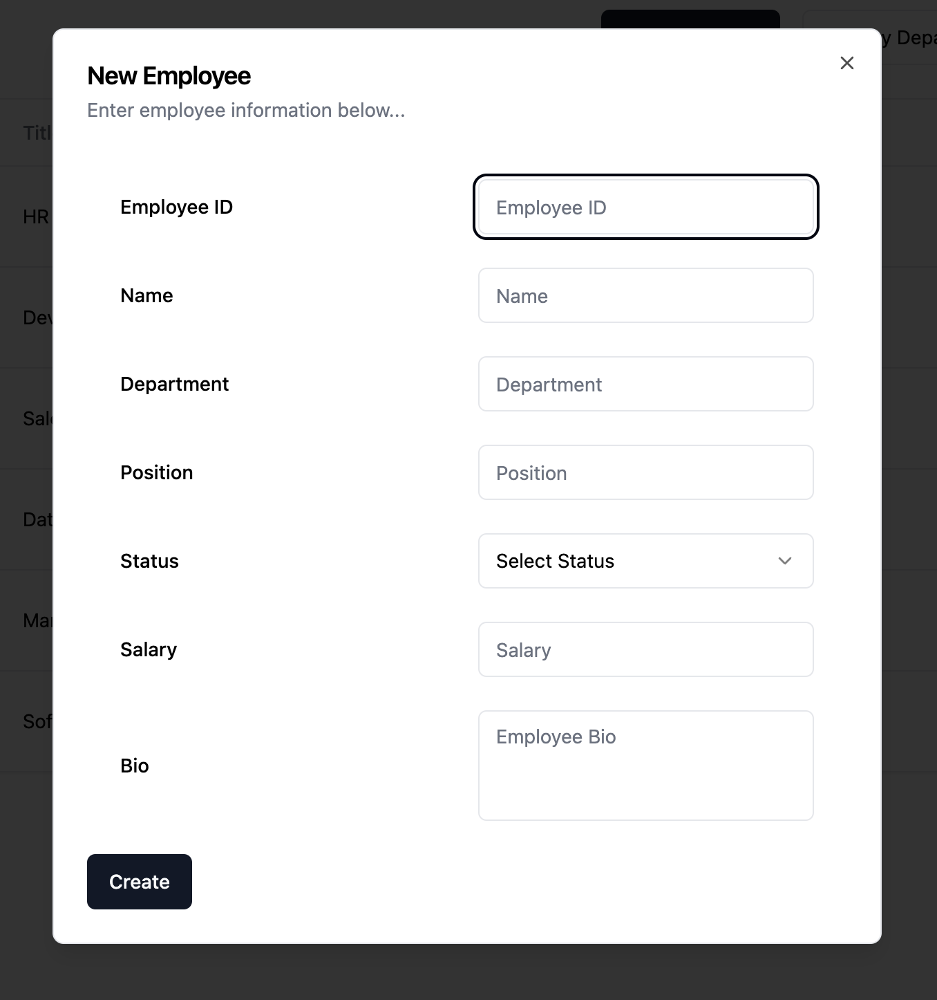
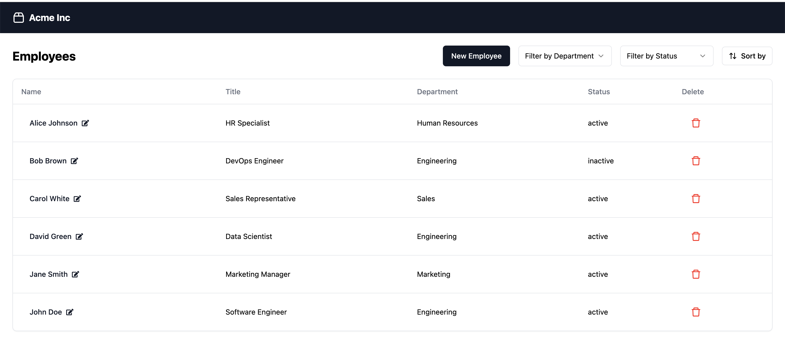
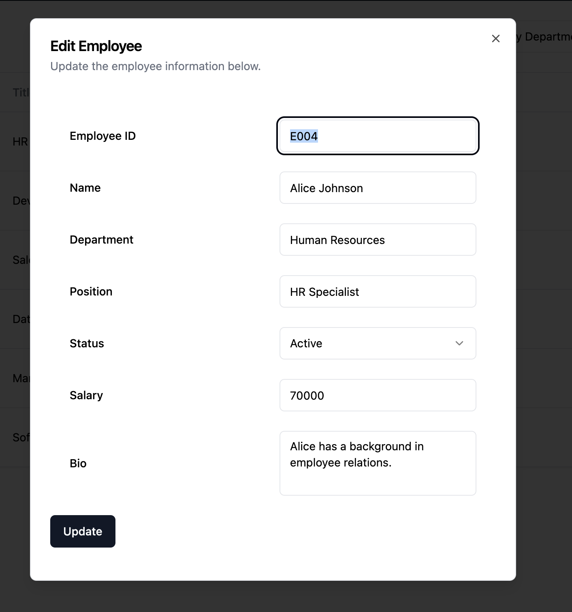

## Employee Dashboard TL

This employee management application streamlines HR operations by providing a responsive dashboard for managing employee records, including features to view, add, edit, and delete employees with robust data validation.

### Getting Started

1. Run `npm install` in the root directory of the project.

2. Create a `.env` file in the root directory or the project and set the `DATABASE_URL` to the desired postgres connection string. Refer to `.env.sample` as an example.

3. Run `npx prisma db push` to push the initial schema to the database.

4. Run `npm run seed` to seed existing database.

5. Run `npm run dev` and navigate to `http://localhost:3000`

### User Flow

#### Creating a New Employee



To add an employee, click on "New Employee" on the root of the application (`http://localhost:3000`). After filling out employee information and pressing `Create`, you will see the new employee on the employee list.

#### Listing Employees



From the employee list, you can filter by `Status` and `Department`, as well as sort by `Name`, `Position`, `Department`, and `Status`.

#### Editing an Employee



To edit an employee, click on the employee's name on the employee list. After editing employee information and pressing `Update`, you will see the updated employee data reflected on the employee list page at the root of the application.

### API Endpoints

#### Create Employee

`POST /api/employee`

| Field       | Type                            | Required |
| ----------- | ------------------------------- | -------- |
| employee_id | string                          | yes      |
| name        | string                          | yes      |
| department  | string                          | yes      |
| position    | string                          | yes      |
| salary      | number                          | yes      |
| bio         | string                          | no       |
| status      | string ("active" or "inactive") | yes      |

##### Example cURL command

$ `curl -X POST http://localhost:3000/api/employee \
-H "Content-Type: application/json" \
-d '{"employee_id":"1234","name":"John Doe","department":"Engineering","position":"Developer","salary":800,"bio":"John analyzes company data to drive decisions.","status":"active"}'`

#### Update Employee

`PUT /api/employee`

| Field       | Type                            | Required |
| ----------- | ------------------------------- | -------- |
| employee_id | string                          | yes      |
| name        | string                          | yes      |
| department  | string                          | yes      |
| position    | string                          | yes      |
| salary      | number                          | yes      |
| bio         | string                          | no       |
| status      | string ("active" or "inactive") | yes      |

##### Example cURL command

$ `curl -X PUT http://localhost:3000/api/employee/[employee-id] \
-H "Content-Type: application/json" \
-d '{"employee_id": "12345","name": "Jonny Doe", "department": "Engineering", "position": "Software Engineer", "salary": 75000, "bio": "Experienced software engineer with a background in developing scalable applications.", "status": "active"
}'`

Example Response

```json
{
  "employee": {
    "id": 61,
    "employee_id": "12345",
    "name": "Jonny Doe",
    "department": "Engineering",
    "position": "Software Engineer",
    "bio": "Experienced software engineer with a background in developing scalable applications.",
    "status": "active",
    "salary": 75000
  }
}
```

#### Delete Employee

`DELETE /api/employee/id`

##### Example cURL command

$ `curl -X DELETE http://localhost:3000/api/employee/[employee-id]`

Example Response

```json
{
  "delete": true
}
```

#### Get Employee

`GET /api/employee/id`

$ `curl https://api.example.com/api/employee/[employee-id]`

Example Response

```json
{
  "employee": {
    "id": 61,
    "employee_id": "E005",
    "name": "Carol White",
    "department": "Sales",
    "position": "Sales Representative",
    "bio": "Carol has a knack for closing deals.",
    "status": "active",
    "salary": 75000
  }
}
```

#### List Employees

`GET /api/employee/id`

$ `curl https://api.example.com/api/employee/[employee-id]`
